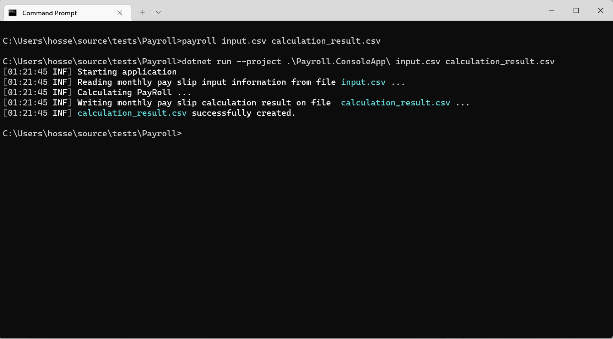

# Payroll

## About Project
Payroll is a test project to calculate employees' monthly pay slips from a CSV file provided as input and will generate results in a new CSV file. 
The Architecture used in this project is Clean Architecture. It has two executable applications.
- Payroll: an asp.net core project using swagger UI, you can send the input CSV file, which will return the result as another CSV file.
- Payroll.ConsoleApp: a command line application. It can take two arguments. The first argument is the source file address, and the second is the destination file address.

Both Payroll and Payroll.ConsoleApp projects share the same Application, Infrastructure, and Domain layer.
### Requirements:
You need to install .net core version 6.

### How to run the Application
After cloning the repository, open the project root folder in the command prompt. The root folder contains some files to help run the Application easier.
- input.csv and monthly_pay_slips_input_sample.csv that you can use as sample CSV files with the correct format.
- payroll.cmd file, a batch file, will help you run the command line application more easily. You can pass two parameters to this command. The first parameter is the input CSV file address, and the second is the output CSV file address. For example, to use this command, open cmd and run this command: `payroll input.csv calculation_result.csv` .After running this command, it will read employee information from the input.csv file and generate the calculation result in calculation_result.csv in the current directory. In case you can not use the payroll.cmd, you can manually run this command at the command line: `dotnet run --project .\Payroll.ConsoleApp\ input.csv calculation_result.csv`
- payrollweb.cmd file, a batch file, will help you run the web application. Simply run this command: payrollweb and will start asp.net core application and will run the Application at this [https://localhost:5001](https://localhost:5001 "https://localhost:5001") address. After the Application runs successfully, you need to open the [Swagger UI](https://localhost:5001/swagger/index.html "Swagger UI") in your browser to start testing the Application.

