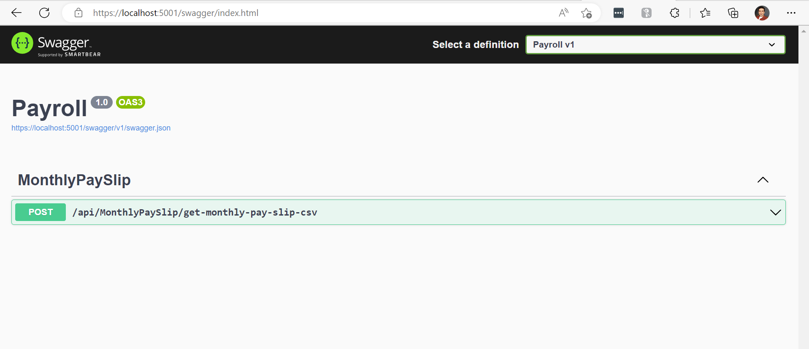

# Payroll

## About Project
This is a test project to calculate employees monthly pay slip from a csv file provided as input and will generate result in a new csv file.
The Architecture is being used at this project is Clean Architecture. it has two executable applications.
- Payroll : an asp.net core project. using swagger UI you can send the input csv file and it will return the result as anohter csv file.
- Payroll.ConsoleApp : a command line application. it can take two argument. first argument is source file address and second is destination file address.

both Payroll and Payroll.ConsoleApp projects are sharing the same Application, Infrastructure and Domain layer.

### Requirements:
you need to install .net core version 6.
### How to run Application
after cloning the repository, open the project root folder in command prompt.the root folder contains some files to help running application.
- input.csv and monthly_pay_slips_input_sample.csv that you can use as sample csv files with the right format.
- **payroll.cmd** file that is a batch file, will help you running command line application easier. you can pass two parameters to this command. first parameter is the input csv file address and second parameter is output csv file address. example to use this command, open cmd and run this command:  `payroll input.csv calculation_result.csv`
after running this command it will read employee information from input.csv file and it will generate the result in calculation_result.csv at current directory. in case you can not use the payroll.cmd, you can manually run this command at command line: `dotnet run --project .\Payroll.ConsoleApp\ input.csv calculation_result.csv`

- **payrollweb.cmd** file that is a batch file will help you running the web application. just simply run this command: `payrollweb` and will start asp.net core application and will run application at this [https://localhost:5001](https://localhost:5001 "https://localhost:5001") address.after application is run successfully you need to open the [Swagger UI](https://localhost:5001/swagger "Swagger UI url") in your browser to start testing application.

